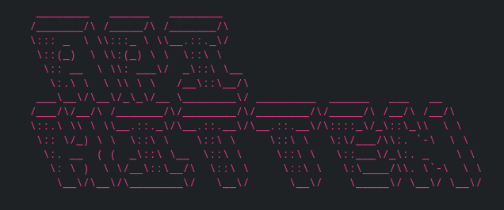

# What is it?

 A Golang CLI that I built over the weekend to solve my problem of storing API Keys on photo apps or other easily compromisable applications.

 Non-technical user frinedly install and run!

 API Kitten uses [Advanced Encryption Standard (AES) library](https://pkg.go.dev/crypto/aes) to encrypt and decrypt entered keys.


## Installation

Install my-project with npm

```bash
  npm install my-project
  cd my-project
```
    
## Features 
