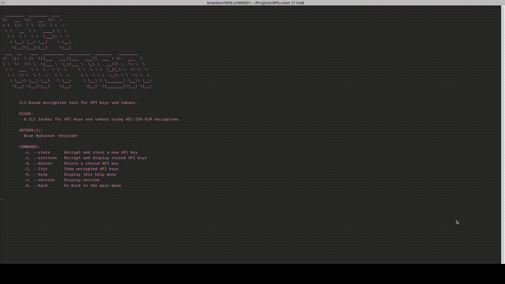

# What is it?
 APIKitten is an open-source command line program that I built over the weekend to solve my problem of storing API keys in compormisable applications.
 This CLI helps store and retrieve api keys using diffrienetial password protection and [AES Go library](https://pkg.go.dev/crypto/aes) to encrpyt sensitive data...

## Demo



## Installation

Install via go

```bash
  go install github.com/Btylrob/APIKitten
```
    
## Commands
APIKitten focuses on simplicity using straight forward CLI commands to retrive and store API Keys. 

```bash
Commands:
   -s, --store       Encrypt and store a new API key
   -r, --retrieve    Decrypt and display stored API keys
   -d, --delete      Deletes stored API key
   -l, --list        Show encrypted API keys
   -h, --help        Display this help menu
   -v, --version     Display version
```

